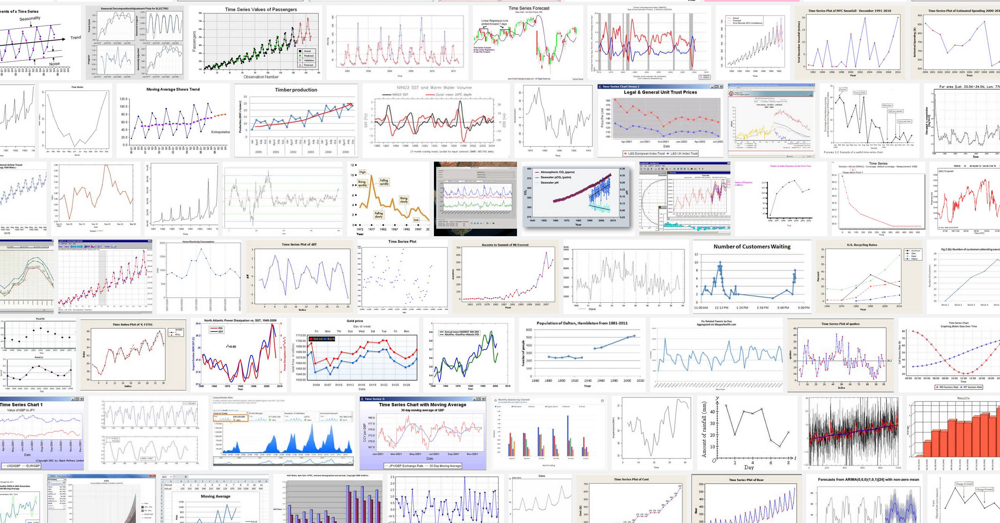
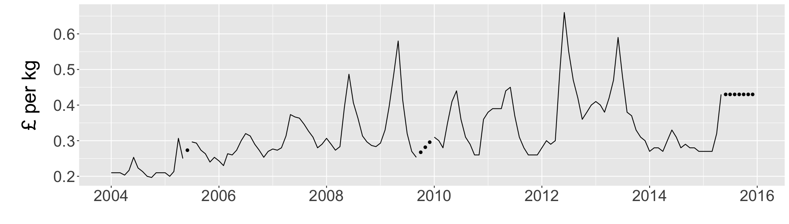
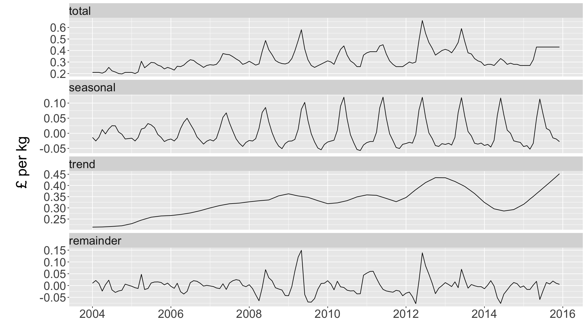
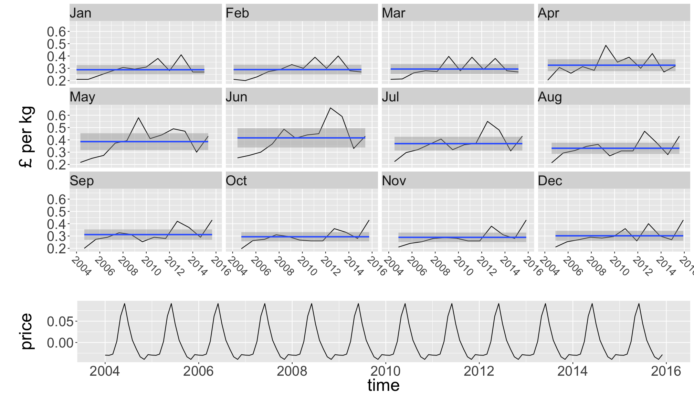
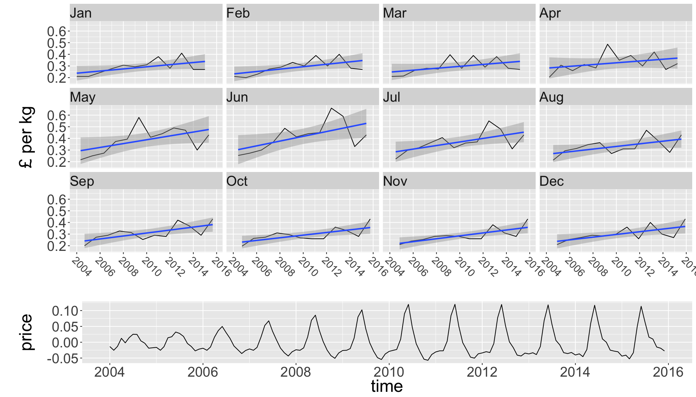
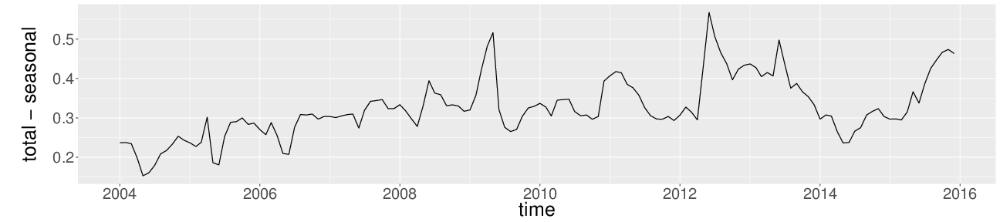
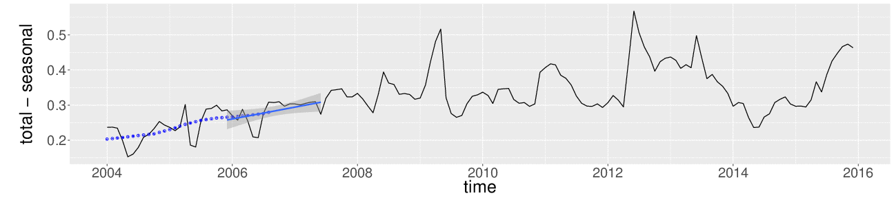
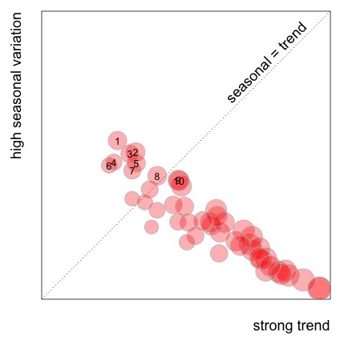
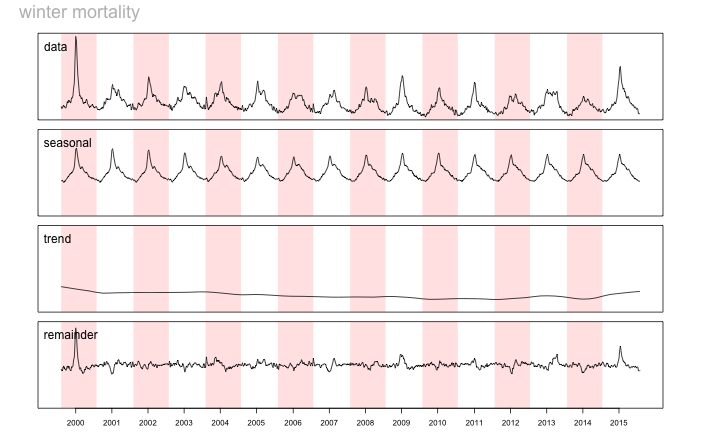
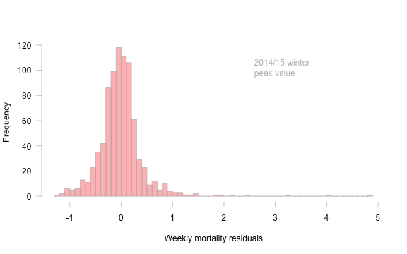

Seasonal trend decomposition of fruit and veg wholesale prices
==============================================================
author: Roman Popat - The Data Lab
date: 20/01/2016
transition: linear
css: mystyle.css
width: 1280 
height: 800

|  |  |  
|-------------------------|-----------------------------|---------------------------
| rmnppt.com              | @rmnppt                     | rmnppt


Time series are everywhere
==========================



Seasonal-Trend decomposition
============================

* Allows separation of repeated or rhythmic effects from overall trend.
* Fast implementation in R via `stats::stl()`
* Very simple to understand/explain.

R. B. Cleveland, W. S. Cleveland, J.E. McRae, and I. Terpenning (1990)  
**STL: A Seasonal-Trend Decomposition Procedure Based on Loess.**  
*Journal of Official Statistics*, 6, 3–73.


Fruit and Veg Prices (DEFRA)
============================


```r
head(dat)
```

```
Source: local data frame [6 x 4]
Groups: year, month [1]

   year  month   subcategory price
  (int) (fctr)        (fctr) (dbl)
1  2004    Jan   Alstromeria  0.93
2  2004    Jan      Anemones  0.39
3  2004    Jan Asian Lillies  1.07
4  2004    Jan     Asparagus    NA
5  2004    Jan     Aubergine    NA
6  2004    Jan      Beetroot  0.25
```

```r
length(unique(dat$subcategory))
```

```
[1] 65
```


Carrots
========

```r
carrots <- subset(dat, subcategory == "Carrots")
carrots$filled_price <- na.approx(carrots$price, rule = 2)
carrot_ts <- ts(carrots$filled_price, frequency = 12)
```




Carrot price decomposition
==========================

```r
carrot_stl <- stl(carrot_ts, 
                  s.window = 12,
                  s.degree = 1,
                  t.window = 21,
                  t.degree = 1)
carrot_stl
```

```
 Call:
 stl(x = carrot_ts, s.window = 12, s.degree = 1, t.window = 21, 
    t.degree = 1)

Components
            seasonal     trend     remainder
Jan  1 -0.0136648682 0.2138007  9.864150e-03
Feb  1 -0.0253784900 0.2140527  2.132580e-02
Mar  1 -0.0132616996 0.2143047  8.957035e-03
Apr  1  0.0122652680 0.2145566 -2.348857e-02
May  1 -0.0020293263 0.2152978  3.398186e-03
Jun  1  0.0145500489 0.2160390  2.274431e-02
Jul  1  0.0251254185 0.2167801 -1.857223e-02
Aug  1  0.0246937249 0.2177984 -2.915880e-02
Sep  1  0.0041390008 0.2188167 -2.295566e-02
Oct  1 -0.0030664950 0.2198349 -2.010176e-02
Nov  1 -0.0188278615 0.2230027  5.825121e-03
Dec  1 -0.0175334120 0.2261706  1.362853e-03
Jan  2 -0.0162836505 0.2293384 -3.054726e-03
Feb  2 -0.0253923321 0.2346426 -9.250249e-03
Mar  2 -0.0141239369 0.2399468 -1.248952e-02
Apr  2  0.0140269644 0.2452510  4.738871e-02
May  2  0.0173242332 0.2495410 -1.686525e-02
Jun  2  0.0321681895 0.2538310 -1.266589e-02
Jul  2  0.0278456689 0.2581211  1.069994e-02
Aug  2  0.0184124101 0.2599796  1.494128e-02
Sep  2 -0.0038985589 0.2618382  1.539366e-02
Oct  2 -0.0134009015 0.2636968  1.303741e-02
Nov  2 -0.0273325942 0.2643431  2.989465e-03
Dec  2 -0.0218943689 0.2649894  1.023827e-02
Jan  3 -0.0189654407 0.2656357 -3.336969e-03
Feb  3 -0.0254619263 0.2672029 -1.174098e-02
Mar  3 -0.0150346704 0.2687701  9.597937e-03
Apr  3  0.0157560471 0.2703372 -2.609328e-02
May  3  0.0366610612 0.2726328 -3.596055e-02
Jun  3  0.0497898680 0.2749284 -2.471828e-02
Jul  3  0.0305897264 0.2772240  1.218627e-02
Aug  3  0.0121743565 0.2805821  2.057684e-02
Sep  3 -0.0118734033 0.2839403  1.793312e-02
Oct  3 -0.0236623043 0.2872984  9.697217e-03
Nov  3 -0.0357540349 0.2914005 -2.313143e-03
Dec  3 -0.0261739608 0.2955026  6.713601e-04
Jan  4 -0.0212664712 0.2996047 -1.671553e-03
Feb  4 -0.0254130870 0.3031483 -4.401902e-03
Mar  4 -0.0163870356 0.3066920 -1.030492e-02
Apr  4  0.0160440723 0.3102356 -1.294632e-02
May  4  0.0530105291 0.3129291  7.393699e-03
Jun  4  0.0675585145 0.3156226 -1.651447e-02
Jul  4  0.0343769639 0.3183161  1.064022e-02
Aug  4  0.0070161539 0.3193043  2.034619e-02
Sep  4 -0.0185502682 0.3202925  2.492444e-02
Oct  4 -0.0332046219 0.3212807  2.192396e-02
Nov  4 -0.0435143168 0.3231947  3.196223e-04
Dec  4 -0.0303088886 0.3251087 -4.799835e-03
Jan  5 -0.0237678975 0.3270228  3.411811e-03
Feb  5 -0.0255343788 0.3285616 -1.302726e-02
Mar  5 -0.0178792671 0.3301005 -3.888793e-02
Apr  5  0.0162543624 0.3316394 -6.456045e-02
May  5  0.0693443930 0.3328568 -8.867875e-03
Jun  5  0.0853976804 0.3340742  6.719478e-02
Jul  5  0.0383208438 0.3352916  3.305422e-02
Aug  5  0.0021034513 0.3413971  1.983275e-02
Sep  5 -0.0248927755 0.3475027 -9.276544e-03
Oct  5 -0.0423457019 0.3536082 -1.459581e-02
Nov  5 -0.0508064812 0.3566438 -1.917066e-02
Dec  5 -0.0339447650 0.3596794 -4.240134e-02
Jan  6 -0.0261472386 0.3627151 -4.323450e-02
Feb  6 -0.0254676591 0.3595743 -4.106680e-03
Mar  6 -0.0202603724 0.3564336  6.049343e-02
Apr  6  0.0130160506 0.3532929  1.203577e-01
May  6  0.0796492109 0.3512087  1.491420e-01
Jun  6  0.1022690378 0.3491246 -3.806031e-02
Jul  6  0.0427206326 0.3470405 -6.976110e-02
Aug  6 -0.0016663503 0.3420604 -7.039400e-02
Sep  6 -0.0286099002 0.3370802 -5.513701e-02
Oct  6 -0.0486609321 0.3321001 -1.593919e-02
Nov  6 -0.0546788401 0.3276167  8.728806e-03
Dec  6 -0.0371084899 0.3231333  9.808546e-03
Jan  7 -0.0288552516 0.3186499  2.020540e-02
Feb  7 -0.0256868908 0.3198408  5.846075e-03
Mar  7 -0.0228847085 0.3210318 -1.814707e-02
Apr  7  0.0096804144 0.3222227  1.809684e-02
May  7  0.0900026107 0.3255253 -5.527874e-03
Jun  7  0.1194245671 0.3288278 -8.252352e-03
Jul  7  0.0476401832 0.3321303 -1.977049e-02
Aug  7 -0.0046530220 0.3377337 -2.308067e-02
Sep  7 -0.0312805269 0.3433371 -2.205655e-02
Oct  7 -0.0537187759 0.3489405 -3.522169e-02
Nov  7 -0.0570829243 0.3519496 -3.486664e-02
Dec  7 -0.0387002609 0.3549587  4.374160e-02
Jan  8 -0.0307398753 0.3579678  5.277211e-02
Feb  8 -0.0271966534 0.3573124  5.988427e-02
Mar  8 -0.0271057004 0.3566570  6.044871e-02
Apr  8  0.0033433628 0.3560016  3.065503e-02
May  8  0.0842320591 0.3513856  4.382293e-03
Jun  8  0.1196697093 0.3467697 -1.643940e-02
Jul  8  0.0507771438 0.3421537 -2.293087e-02
Aug  8 -0.0013812769 0.3372682 -2.588697e-02
Sep  8 -0.0241200246 0.3323828 -2.826275e-02
Oct  8 -0.0471388550 0.3274973 -2.035844e-02
Nov  8 -0.0502686290 0.3337159 -2.344725e-02
Dec  8 -0.0365598052 0.3399345 -4.337466e-02
Jan  9 -0.0338205714 0.3461530 -3.233248e-02
Feb  9 -0.0299234560 0.3578454 -2.792195e-02
Mar  9 -0.0325647001 0.3695378 -4.697307e-02
Apr  9 -0.0041350179 0.3812301 -7.709512e-02
May  9  0.0774168571 0.3918168  2.076638e-02
Jun  9  0.1190459047 0.4024034  1.385507e-01
Jul  9  0.0532208610 0.4129900  8.378912e-02
Aug  9  0.0013920944 0.4203421  4.826579e-02
Sep  9 -0.0172630264 0.4276942  9.568814e-03
Oct  9 -0.0407152730 0.4350463 -3.433104e-02
Nov  9 -0.0434635073 0.4348902 -1.142665e-02
Dec  9 -0.0343642691 0.4347340 -3.697343e-04
Jan 10 -0.0369298418 0.4345778  1.235199e-02
Feb 10 -0.0332467165 0.4290364  4.210326e-03
Mar 10 -0.0389912199 0.4234949 -4.503712e-03
Apr 10 -0.0134990222 0.4179535  1.554555e-02
May 10  0.0685167867 0.4105976 -9.114407e-03
Jun 10  0.1179129575 0.4032418  6.884527e-02
Jul 10  0.0567725639 0.3958859  2.734152e-02
Aug 10  0.0059255254 0.3852222 -1.114775e-02
Sep 10 -0.0087743525 0.3745585  4.215810e-03
Oct 10 -0.0329630261 0.3638949 -9.318292e-04
Nov 10 -0.0358721967 0.3505672 -4.695010e-03
Dec 10 -0.0323859704 0.3372396 -4.853587e-03
Jan 11 -0.0402993947 0.3239119 -1.361251e-02
Feb 11 -0.0368046738 0.3144573  2.347395e-03
Mar 11 -0.0456268509 0.3050026  2.062420e-02
Apr 11 -0.0230231530 0.2955480 -2.524866e-03
May 11  0.0595055745 0.2923197 -5.182524e-02
Jun 11  0.1167325895 0.2890913 -7.582390e-02
Jul 11  0.0603405671 0.2858630 -3.620353e-02
Aug 11  0.0105376955 0.2880095 -1.854720e-02
Sep 11 -0.0001445005 0.2901560 -1.154585e-05
Oct 11 -0.0250238223 0.2923026  1.272123e-02
Nov 11 -0.0280481505 0.3001245  7.923606e-03
Dec 11 -0.0301522884 0.3079465 -7.794211e-03
Jan 12 -0.0439143613 0.3157685 -1.854092e-03
Feb 12 -0.0408889835 0.3275099 -1.662093e-02
Mar 12 -0.0525558416 0.3392514 -1.669554e-02
Apr 12 -0.0330749584 0.3509928  2.082117e-03
May 12  0.0489623582 0.3634192  1.761846e-02
Jun 12  0.1133913319 0.3758455 -5.923685e-02
Jul 12  0.0638193115 0.3882719 -2.209117e-02
Aug 12  0.0161475388 0.4009421  1.291035e-02
Sep 12  0.0099335614 0.4136124  6.454085e-03
Oct 12 -0.0152016085 0.4262826  1.891901e-02
Nov 12 -0.0189365686 0.4393722  9.564334e-03
Dec 12 -0.0276530427 0.4524619  5.191173e-03
```

Carrot price decomposition
==========================
transition: none



Calculating the seasonal component
==================================

```r
carrot_stl <- stl(carrot_ts, s.window = "periodic",
                             t.window = 21, t.degree = 0)
```


Calculating the seasonal component
==================================
transition: none

```r
carrot_stl <- stl(carrot_ts, s.window = 12, s.degree = 1,
                             t.window = 21, t.degree = 1)
```



Calculating the trend component
===============================
incremental: true
* total - seasonal  

* loess  



Calculating the remainder
=============================== 
seasonal *done*  
trend *done*  

data = seasonal + trend + **remainder**


Carrot price decomposition
==========================


Examples 1: DEFRA
=================
    


***

 place  | item                    |	seasonal | trend  
--------|-------------------------|----------|--------
 1 	    | Strawberries 	          |    0.555 | 0.2436 
 2 	    | Narcissus-inc.Daffodils |	  0.5115 | 0.3113 
 3 	    | Runner Beans 	          |   0.5051 | 0.2903 
 4 	    | Spinach 	              |    0.474 | 0.2301 
 5 	    | Parsnips 	              |     0.47 | 0.3141 
 6 	    | Raspberries 	          |    0.462 | 0.2125
 7 	    | Cucumbers 	            |   0.4425 |  0.299
 8 	    | Celery 	                |   0.4227 | 0.3922
 9 	    | Carrots 	              |   0.4062 | 0.4706
 10 	  | Swede 	                |   0.4042 | 0.4739


Examples 2: ONS
===============


Examples 2: ONS
===============



Pros and Cons
=============
**Pros**
* Fast (underlying Fortran), good building block
* Can measure the relative size of rhythmic / trend effects
* Can deal with missing values (in principle!)
* Easy to explain/understand

***

**Cons**
* Many parameters to guess/tune
* Not great for forecasting
* Assumes that variation in time driven by cycles + trend
* Assumes that cycles have a constant period


Thank you
=========
type: section

|  |  |  
|-------------------------|-----------------------------|---------------------------
| rmnppt.com              | @rmnppt                     | rmnppt

Roman Popat


